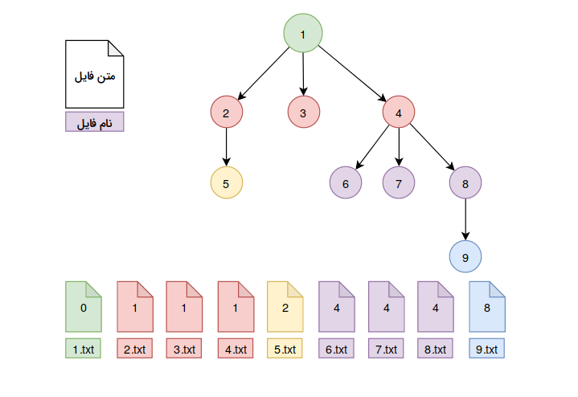

# Files, Files Every Where!


فولدر `files-new.zip` را unzip کنید [files-new.zip](./static/files/files-new.zip)

این فولدر حاوی ۴۰۰۰ فایل با پسوند `.txt` است. نام هر فایل عددی ۸ رقمی است و در صورتی که فایل را باز کنید خواهید دید که متن  هر فایل عدد ۸ رقمی دیگری است. به عبارت دیگر متن هر فایل  به نام `parent` خود اشاره می‌کند. در صورتی که یک فایل `parent` نداشته باشد، متن داخل آن فایل عدد 0 خواهد بود. 


# راهنمایی 




# ابزارهای مورد نیاز

برای به دست آوردن همه فایل های با پسوند `txt` درون یک فولدر از `glob` استفاده کنید. نمونه کد زیر روش استفاده از `glob` را نشان می‌دهد:

```python
import glob

list_of_files = glob.glob('./files/*.txt')
for f in list_of_files:
    print(f)
```


# سوال ۱: 

فایلی که هیچ parent ی ندارد را بیابید


# سوال ۲:

لیستی از تمامی فایل‌هایی که هیچ childی ندارد را (به صورت sort شده) در فایل `no_children.txt` ذخیره کنید


# سوال ۳: 

در صورتی که رابطه child-parent را یال های یک گراف جهت دار فرض کنیم، از فایلی که هیچ parentی ندارد تا فایل هایی که هیچ childی ندارند، مسیرهایی به وجود خواهد آمد، طولانی ترین مسیر ممکن را پیدا کنید و تمام اعضایی که در مسیر آن دیده شده را در فایل `longest_path.txt` ذخیره کنید. 

